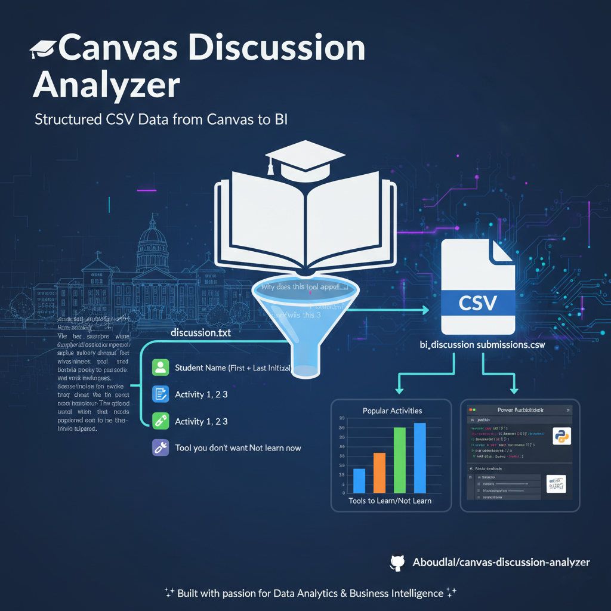

# 🎓 Canvas Discussion Analyzer

This project extracts **structured CSV data** from Canvas Discussions for **Business Intelligence (BI)**.  
It removes irrelevant text (like *"Why does this tool appeal..."*) and keeps only the essential fields:

- 👤 **Student name** (First + Last initial)  
- 📝 **Activity 1, Activity 2, Activity 3**  
- 🛠️ **Tool you don’t want to learn now**  

The output is a **clean CSV file** ready for analysis with **Python (pandas/matplotlib)** or **Power BI (DAX)**.

---

## 🚀 Quick Start

### 1️⃣ Clone the repository
```bash
git clone https://github.com/Aboudlal/canvas-discussion-analyzer.git
cd canvas-discussion-analyzer
```

### 2️⃣ Create and activate a virtual environment

**Windows (PowerShell)**
```bash
python -m venv venv
.
env\Scripts ctivate
```

**Mac/Linux**
```bash
python3 -m venv venv
source venv/bin/activate
```

### 3️⃣ Install dependencies
```bash
pip install -r requirements.txt
```

---

## ▶️ Run the Parser

Prepare your input file:

1. Copy the full Canvas discussion into a plain text file named **`discussion.txt`**.  
2. Place it in the **project root folder**.  

Then run the parser:

**Windows**
```bash
python parse_canvas_discussion.py --in discussion.txt --out bi_discussion_submissions.csv
```

**Linux / macOS**
```bash
python3 parse_canvas_discussion.py --in discussion.txt --out bi_discussion_submissions.csv
```

---

## 📊 Analyze the Data

Once the CSV file is created (**bi_discussion_submissions.csv**), you can analyze it using **Jupyter Notebook**:

```bash
jupyter notebook bi_discussion_analysis.ipynb
```

Inside the notebook, you’ll find examples to:
- 📌 Count the most popular **activities selected**  
- 📌 Count the most popular **tools to learn**
- 📌 Count the most popular **tools not to learn now**  
- 📊 Create bar charts and visualizations
- Dynamic Storytelling Conclusion

---

## 🔗 Useful Links

- 👨‍💻 GitHub Profile: [https://github.com/Aboudlal](https://github.com/Aboudlal)  
- 📂 Project Repository: [https://github.com/Aboudlal/canvas-discussion-analyzer](https://github.com/Aboudlal/canvas-discussion-analyzer)  

---

## 🛡️ Notes

- Make sure you do **not push your `venv/` folder** to GitHub (already excluded in `.gitignore`).  
- You only need to share the **code, requirements, and notebooks**.  

✨ Built with passion for **Data Analytics & Business Intelligence** ✨
